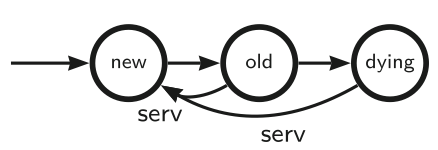
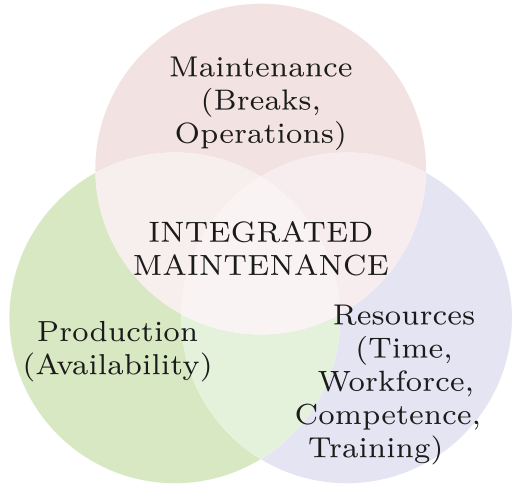
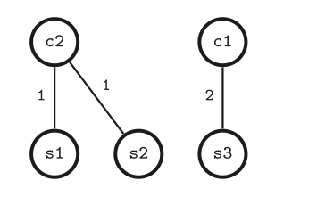
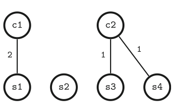
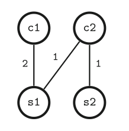
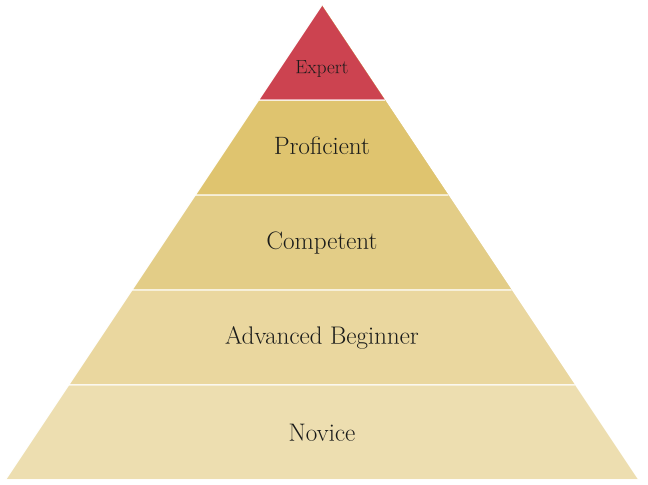
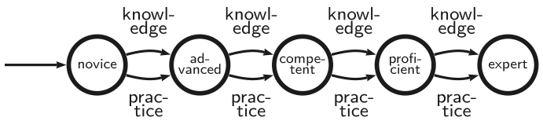
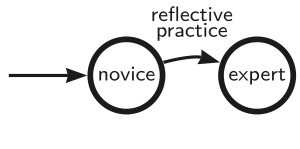
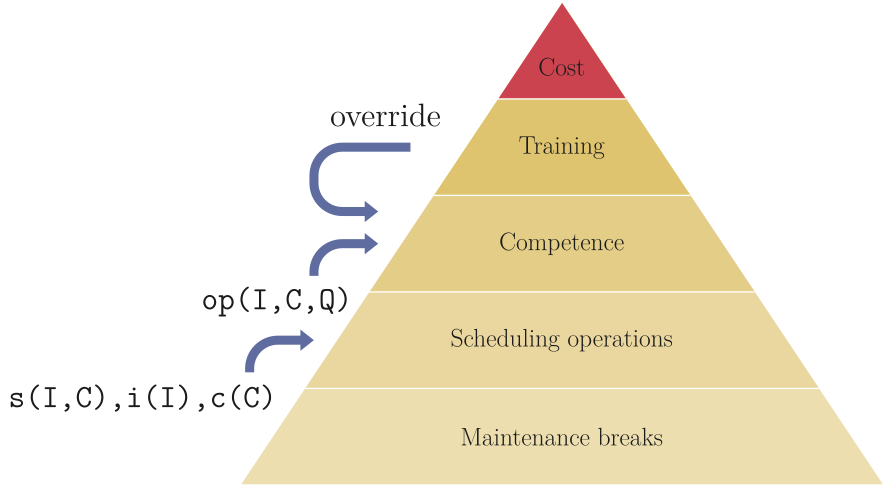
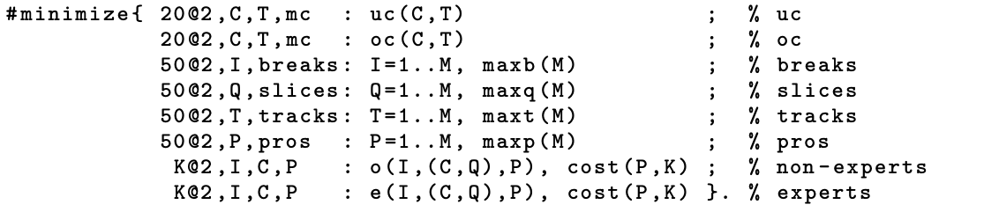

### Integrating Competencies into Preventive Maintenance Scheduling with Answer Set Optimization

The work reported in the paper [Integrating Competencies into Preventive Maintenance Scheduling with Answer Set Optimization. 13th International Symposium on Foundations of Information and Knowledge Systems](https://link.springer.com/chapter/10.1007/978-3-031-56940-1_21) focuses on resource scheduling.  From the perspective of an individual component, preventive maintenance scheduling is a simple process.  Tthe purpose is to renew the component when it is getting too old:

   

This is the PMS Core and it assumes the horizon (h), the number of breaks (b), and the description of the ages and intervals for each component.  Here is an example description:

```
comp(1, 5,2).  comp(2,10,0).  comp(3, 7,0).  comp(4, 4,3).  
comp(5, 9,0).  comp(6,11,2).  comp(7, 5,4).  comp(8, 8,0).  
```

Integrated maintenance combines maintenance scheduling with production scheduling and resource scheduling.   This means the scheduling of maintenance operations, maintenance workforce, and training of the workforce.  In addition, the maintenance breaks and their duration are minimized which increases the availability of the production machinery and contributes to production scheduling.  

<p align="center"></p>

The paper introduces three resource models:

1. Quantitative resources:

   

   Quantitative maintenance resources involve time slices, maintenance tracks, and professionals.  The resources are employed to perform the scheduled maintenance operations.  For each timeslice of the maintenance break, there can be one or more component(s) under maintenance.   Each component requires one or more professional(s) to do the servicing.  By allocating the components wisely, it is possible to achieve improvements in the usage of resources.  Below, there are three ways to schedule the same set of maintenance operations:

     

Such scheduling is based on the the information of the specified time slices (q), tracks (t), professionals (p), and the knowleged of the time and personnel requirements of each component, like in the following:

```
durreq(1,2).  durreq(2,1).  durreq(3,1).  durreq(4,1).  
durreq(5,3).  durreq(6,2).  durreq(7,1).  durreq(8,1).

proreq(1,2).  proreq(2,2).  proreq(3,1).  proreq(4,1).  
proreq(5,2).  proreq(6,3).  proreq(7,1).  proreq(8,2).  
```

3. Competence resources:

   Competence resources refer to the competence of the maintenance professionals and their related capacity to take responsibility of the maintenance of specific components.  In this model, the component-specific requirements for experts is satisfied by allocating a sufficient number of experts to each.  In Benner's model of expertise, there are several levels of expertise, but these are not elaborated in this work.
   
   

   The allocation of experts is based on the competence matrix and the componentwise requirements, given in the following way:

   ```
   expreq(1,1). expreq(2,1). expreq(3,1). expreq(4,1).
   expreq(5,2). expreq(6,3). expreq(7,1). expreq(8,2).

   expert(1, 1..8).  expert(2, 2..6).  expert(3, 7..8).  expert(4, (1;4;7)).
   expert(5, (2;6)). expert(6, (1;5)). expert(7, 6..8).  expert(8, 4..5).
   ```

5. Training resources:

   Training resources refer to the potential resources that involve teaching and learning.  One expert can train a novice (training resource) and then the novice becomes an expert and increases the capacity of the pool of professionals to handle different situations where the level expertice is a bottleneck for efficient maintenance operations.  Originally, Benner's from expert to novice model involves multiple stages:

   

   However, the current model simplifies the professional development by reducing it to just two essential stages.
   
   

Interfaces and integration:

The three resource models are designed to be compatible with each other.  However, they need one interface to get information from the core maintenance scheduler.   This interface is based on the components (c), the break indices (i), and the service operations (s).  



Furthermore, the parameters t,q, and p must be limits for the resource usage rather than the actual usage parameters.  The scheduling has to optimize their usage and the total cost of professionals along with the maintenance miscoverage that is being optimized by the PMS Core.   This is achieved through a new objective function that incorporates all the aspects into a weighted sum of different aspects of the costs.  They are: uc=undercoverage, oc=overcoverage, used breaks, used slices, used tracks, used professionals, and used non-expert time slices and expert time slices:



At this point, also the cost of employing a professional for a time slice is taken into account:

```
cost(1,5). cost(2,2). cost(3,0). cost(4,2). 
cost(5,2). cost(6,0). cost(7,2). cost(8,0). 
```


Files in the directory _asp_:

* service-cov-ocov-v1.mod3.lp - the core Preventive Maintenance Scheduler
* mod3.lp - the pruning rules that are optionally included
* lib-db.lp - the knowledge database for a test machine and service team
* lib-golden.lp - golden breaks for the the machine with h=32, b=7
* interface.lp - the interface required for integrated scheduling
* lib-ops.lp - the operations model (RM1)
* lib-cmp.lp - the competence model (RM2)
* lib-dyn.lp - the dynamic competence model (RM3)
* lib-itg.lp - weight-based integration
* tests.sh - tests to obtain Table 1 and Table 2
* tests.out - output of the test run


