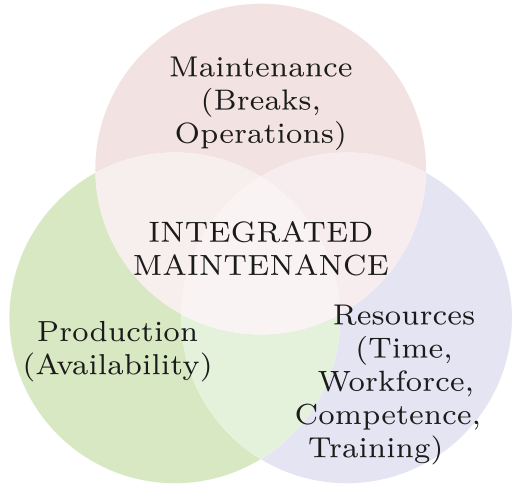
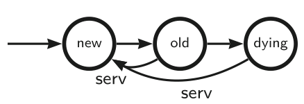
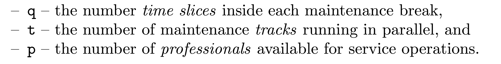
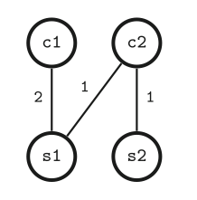
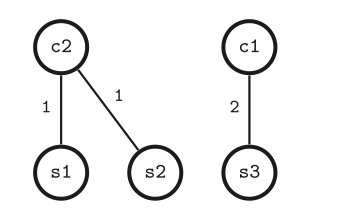
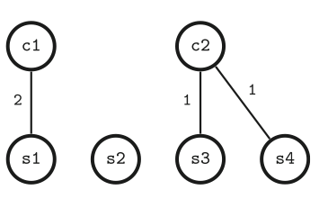
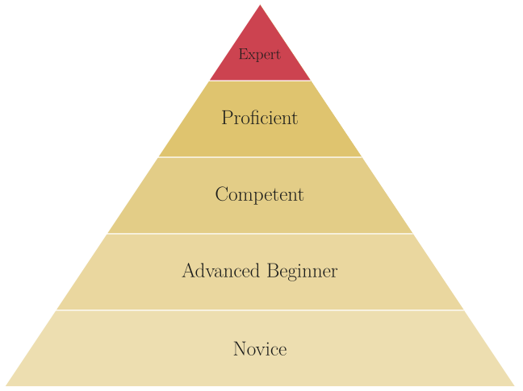
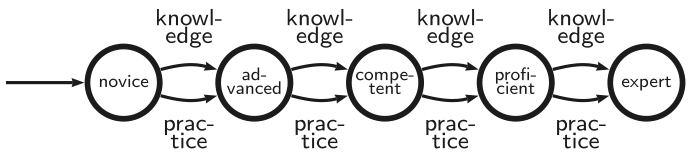
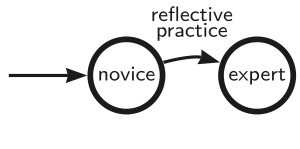
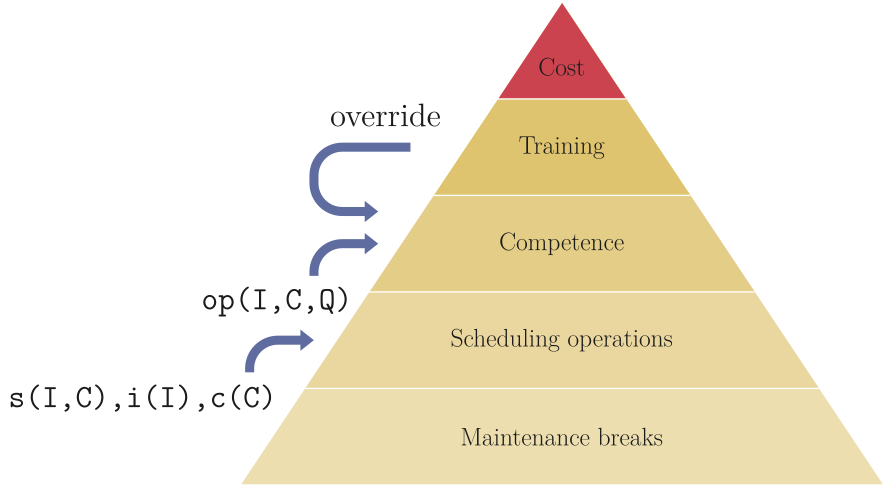

From the perspective of an individual component, preventive maintenance scheduling is a very simple process:  
the purpose is to renew the component when it is getting too old:

   

Integrated maintenance combines maintenance scheduling with production scheduling and resource scheduling.  The work reported in the paper ... focuses on resource scheduling.  This means the scheduling of maintenance operations, maintenance workforce, and training of the workforce.  In addition, the maintenance breaks and their duration are minimized which increases the availability of the production machinery and contributes to production scheduling.  

The paper introduces three resource models:

1. Quantitative resources:

   

   Quantitative maintenance resources involve time slices, maintenance tracks, and professionals.  The resources are employed to perform the scheduled maintenance operations.  For each timeslice of the maintenance break, there can be one or more component(s) under maintenance.   Each component requires one or more professional(s) to do the servicing.  By allocating the components wisely, it is possible to achieve improvements in the usage of resources.  Below, there are three ways to schedule the same set of maintenance operations:

     

2. Competence resources:

   Competence resources refer to the competence of the maintenance professionals and their related capacity to take responsibility of the maintenance of specific components.  In this model, the component-specific requirements for experts is satisfied by allocating a sufficient number of experts to each.  In Benner's model of expertise, there are several levels of expertise, but these are not elaborated in this work.
   
   

4. Training resources:

   Training resources refer to the potential resources that involve teaching and learning.  One expert can train a novice (training resource) and then the novice becomes an expert and increases the capacity of the pool of professionals to handle different situations where the level expertice is a bottleneck for efficient maintenance operations.  Originally, Benner's from expert to novice model involves multiple stages:

   

   However, the current model simplifies the professional development by reducing it to just two essential stages.
   
   

Interfaces and integration:

The three resource models are designed to be compatible with each other.  However, they need an interface through which they get information from the core maintenance scheduler.   

Files:

* service-cov-ocov-v1.mod3.lp - the core Preventive Maintenance Scheduler
* mod3.lp - the pruning rules that are optionally included
* lib-db.lp - the knowledge database for a test machine and service team
* lib-golden.lp - golden breaks for the the machine with h=32, b=7
* interface.lp - the interface required for integrated scheduling
* lib-ops.lp - the operations model (RM1)
* lib-cmp.lp - the competence model (RM2)
* lib-dyn.lp - the dynamic competence model (RM3)
* lib-itg.lp - weight-based integration
* tests.sh - tests to obtain Table 1 and Table 2
* tests.out - output of the test run

